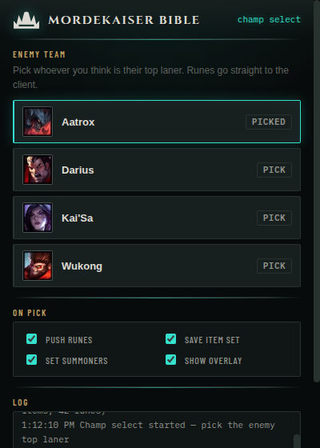
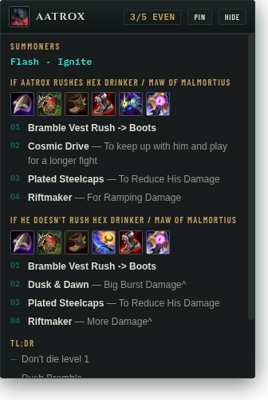

# Mordekaiser Bible — Companion

A desktop companion for the Bible. During champ select you pick which enemy you
think is going top; it pushes the matchup's rune page straight into your client,
saves the item build as an in-shop item set, and optionally sets your summoner
spells. In game, a small always-on-top overlay shows the build order and the
writeup's tips — and switches itself to the real enemy top laner once the game
can tell you who that is.

 

## What it does

- **Runes** — builds the page from the matchup's runes and creates it in the
  client as `MB: <champion>`, already selected. Re-picking replaces the old MB
  page instead of stacking new ones.
- **Items** — saves the matchup's build (both paths, with the author's notes)
  as an item set named `MB: <champion>`, visible in the in-game shop. Your other
  item sets are left untouched.
- **Summoner spells** — optional, off by default. Sets the matchup's spells in
  champ select.
- **Overlay** — frameless always-on-top card with the difficulty, summoners,
  both build paths and the tips. Toggle with `Ctrl/Cmd+Shift+M`, drag by its
  title bar, `pin` makes it click-through, `hide` hides it. Works with League in
  borderless or windowed mode (a fullscreen-exclusive game covers every OS
  window; use borderless, which is what most players run).
- In game it polls Riot's Live Client Data API; when the enemy top laner is
  known it switches the overlay to that matchup automatically.

Everything is per-toggle: runes, items, summoners and the overlay can each be
turned off in the picker window or the tray menu, and the choice persists.

## How it talks to League

Two local, Riot-provided interfaces — the same ones every build companion uses:

- the **LCU API** (the client's own local REST/WebSocket service, credentials
  read from the client's lockfile) for champ select state, rune pages, item
  sets and summoner spells;
- the **Live Client Data API** (`https://127.0.0.1:2999`) for who is in the
  game and what position they hold.

No game memory is read, nothing plays the game for you, and nothing leaves your
machine — there is no server. The overlay shows static guide text.

**No rune, item or spell ID is hardcoded.** On every launch the app reads the
catalog your own client serves (`/lol-game-data/assets/v1/…`) and resolves the
Bible's names against it. Whatever the current patch renamed, the app follows;
whatever it cannot match, it refuses to push and tells you, rather than pushing
a wrong page.

## Installing it

Grab the build for your OS from the repository's **Releases** page:

- **Windows** — `Mordekaiser Bible Companion Setup <version>.exe` is a one-click
  installer; there is also a portable `.exe` that runs without installing.
- **macOS** — the `.dmg`. It is unsigned, so the first launch is
  right-click → Open.
- **Linux** — the `.AppImage`; `chmod +x` it and run.

Installers are produced by the `companion-release` GitHub Actions workflow —
push a `companion-v*` tag (or run the workflow manually from the Actions tab)
and it builds all three platforms and attaches them to a release.

Start the app whenever; it sits in the tray, waits for the League client, and
the picker pops up when champ select starts.

## Running from source

Needs [Node.js](https://nodejs.org) 20+.

```bash
cd companion
npm install
npm start
```

If your League install is somewhere unusual, point the app at the lockfile:

```bash
MB_LOCKFILE="/path/to/League of Legends/lockfile" npm start
```

## Development

```bash
npm test              # full flow against a bundled mock client — no League needed
npm run audit         # resolve all 139 matchups against the real patch catalog
npm run smoke         # boots the real app against the mock and screenshots it
npm run fetch-catalog # refresh the catalog snapshot to the current patch
```

`mock/` contains a faithful fake of the LCU (lockfile, auth, REST, WebSocket
events) and of the Live Client API. The test suite drives the whole flow
through it: connect → champ select → pick → verify the exact rune page, item
set and spell payloads the client would receive → in-game top-laner detection.

### Testing against real Riot data

`test/realdata/` holds a trimmed Data Dragon snapshot — every item, summoner
spell, champion and rune of a real patch, reduced to the fields the resolver
looks at. `test/realdata.js` reshapes it into the layout the LCU serves and
`npm run audit` runs the entire Bible through it, reporting anything that fails
to resolve or resolves to the wrong thing.

This is worth doing because the real catalog is far nastier than any handmade
fixture: 868 items where 214 names are shared by several ids (Arena copies,
Ornn upgrades, mode variants), several champions duplicated as game-mode clones,
and three different summoner spells called "Flash". The audit against it found
and fixed the following, none of which the mock could have caught:

- ties between identically-named items made every abbreviated build step
  ("Rocketbelt", "Liandry's", "Rylai's") resolve to nothing — 256 build rows,
  and four matchups produced an empty item set that the client would reject;
- `Flash` resolved to the Arena spell rather than the Summoner's Rift one;
- game-mode champion clones could shadow the real champion, which would have
  attached item sets to a Mordekaiser nobody plays;
- `Scaling Health` resolved to the *flat* Health shard in 65 matchups, because
  substring containment outranked a full word-set match — the worst kind of
  failure, since a wrong rune is pushed silently;
- a one-letter typo in the source spreadsheet sank a whole rune page;
- a matchup listing three secondary runes produced a ten-perk page;
- two secondary runes from the same row were pushed instead of refused.

Two caveats, stated because the audit's output is only as honest as its inputs:
Data Dragon does not publish the stat-shard rows, so those come from
`mock/stat-shards.js` and are the one part of the rune page not verified against
real data; and the snapshot is a patch-in-time, so a rename after it was taken
would show up on a live client before it shows up here.

**Status:** verified end-to-end against the mock client, including headless runs
of the real Electron app — and of the **packaged** build, which exercises the
same file layout the installers ship. Name resolution is verified against real
Data Dragon files. It has not yet been run against a live League client; any
breakage there will be in lockfile discovery or endpoint shape, both of which
log loudly. If the client boots slower than the app, the companion now retries
every 3 seconds until the client answers.

## A note on Riot policy

Rune/item importers and passive information overlays are the category Riot has
long tolerated (Blitz, Mobalytics, Porofessor and company operate publicly on
exactly these APIs). This app stays inside that: sanctioned local APIs only, no
memory reading, no automation of play. Use it at your own discretion all the
same.
